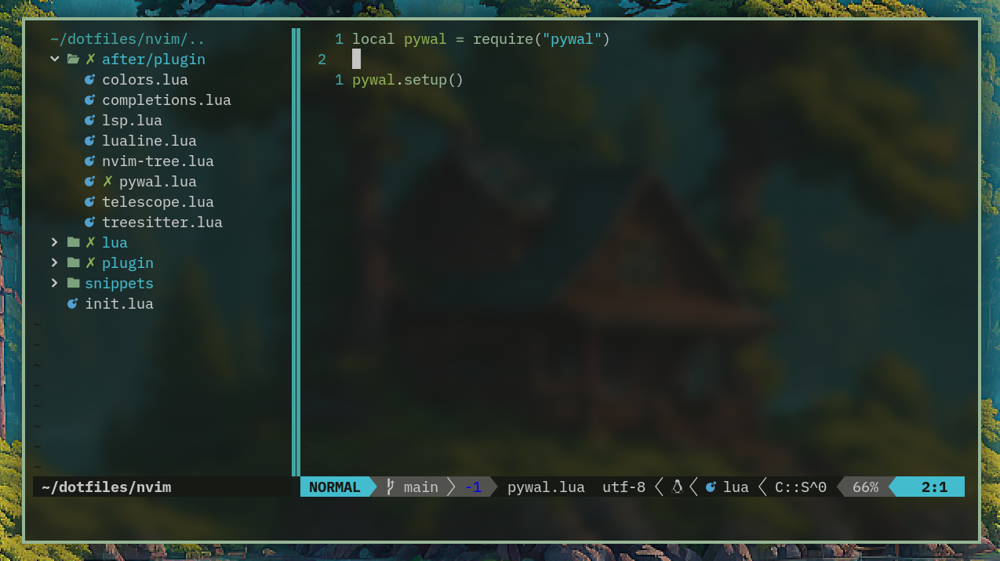

# pywal.nvim

This is a fork of [AlphaTechnolog/pywal.nvim](https://github.com/AlphaTechnolog/pywal.nvim).

I changed some colors to my liking and removed some background colors to allow transparent backgrounds.

## Screenshot

